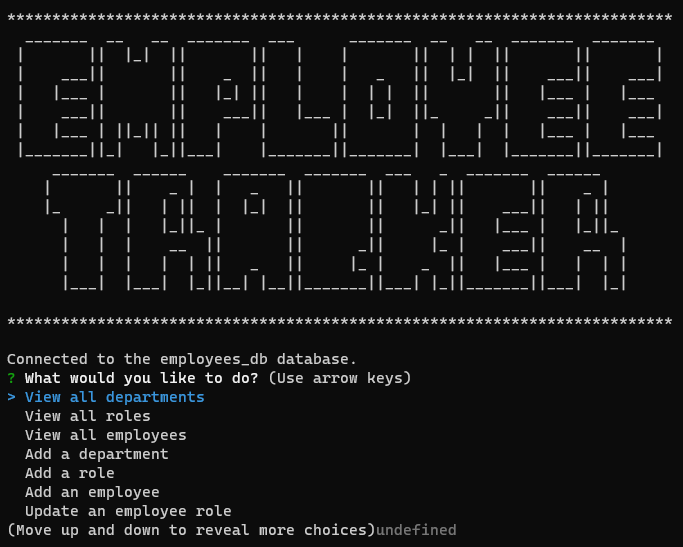

# employee-tracker

## Description

Employee tracker is a command-line application that was created with JavaScript, Node and inquirer and will allow a user to view and edit employee data.

## Usage

- Run "node index.js" in the terminal 
- Follow the prompts to view and edit employee data.

Here is a video walkthrough. [Check it out!](https://drive.google.com/file/d/17BdrP7f2rC9aJomfCJ-2ziZJyJFprBh2/view)

## Credits

Dominique Meeks Gombe provided tutoring and guidance on this project.

## How to Contribute

If you would like to contribute to this project, please reach out to the author.